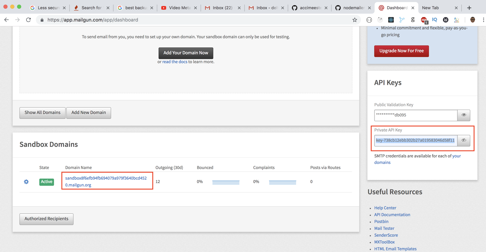

# Submit a form, and receive email - Express + Nodejs + Nodemailer + MailGun

How to send an email on form submission with nodejs

NOTE: In order to run this example, you need to find all the TODO and edit them accordingly. Instructions is attached to every TODO in the codebase. Good luck!

Prerequisite:
- Nodejs (Installed)
- MailGun API_KEY and DOMAIN


Before running any of the following steps. Make sure you run `npm install` to install any dependencies needed for this project. 


#### Step 1
Create a file named `.env`, and copy everything inside the `.env-example` file to the `.env` file. Inside the *.env* file, fill in the information with your [mailgun](https://www.mailgun.com/) DOMAIN and API_KEY. 


#### Step 2
In order to obtain the `apiKey` and `domain`. Navigate to [MailGun](https://mailgun.com). Create an account if you don't have one, scroll all the way down in the dashboard page, you should see your `Private Api Key` , and domain below. 




#### Step 3
Navigate to the `mail.js` file. Make sure that the receiver email is an [authorized recipient](https://app.mailgun.com/app/account/authorized) otherwise you will NOT be able to send email to any recipients on the free tier without authorizing their email. Once you have an authorized recipient, replace the RECEIVER_EMAIL with the authorized recipient email

```
const sendMail = (email, subject, text, cb) => {
    const mailOptions = {
        from: email,
        to: 'RECEIVER_EMAIL', // TODO: the receiver email
        subject,
        text
    };

    transporter.sendMail(mailOptions, function (err, data) {
        if (err) {
            return cb(err, null);
        }
        return cb(null, data);
    });
}
```


#### Step 4
In order to send an email, we can bring our `sendMail` function from `mail.js` file, and use it as below. If everything goes well, you should receive an email.
```
const sendMail = require('./mail');

sendMail(email, subject, text, function(err, data) {
    if (err) {
        return console.log('Error occurs);
    }
    return console.log('Message sent!!!');
});

```


Once you have successfully completed the above steps. Run `npm start` and navigate to http://localhost:8080 to start the app. 

If you're having issues with sending emails, please watch this [walkthrough video](https://youtu.be/JpcLd5UrDOQ). If you are still experiencing issues, please open an issue